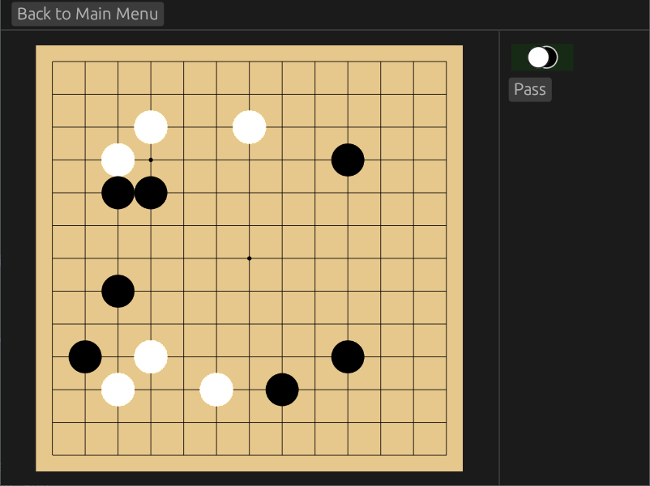

# emi
An application to play simple games.

Currently, only [go](https://en.wikipedia.org/wiki/Go_(game)) can be played.



Right now, this is still in a very unfinished state.

To test it out, first install [rust/cargo](https://rustup.rs/) (or use something
else to install rust, applicable to your system). Then run
```sh
$ cd emi-front/
$ cargo run
```

## Features
- Play go
    - Supports 9x9 through 19x19 sizes
    - Simple ko rules

## Todo
- [ ] Polish go engine
    - [ ] Finishing and scoring go games
    - [ ] Editing menus
    - [ ] Import/Export to SGF
    - [ ] Other ko rules/variations?
- [ ] Change UI
    - [ ] Sidebar should look nicer
    - [ ] Look into attaching engines
    - [ ] Make main menu look nicer
    - [ ] Go board/piece themes
- [ ] Other games
